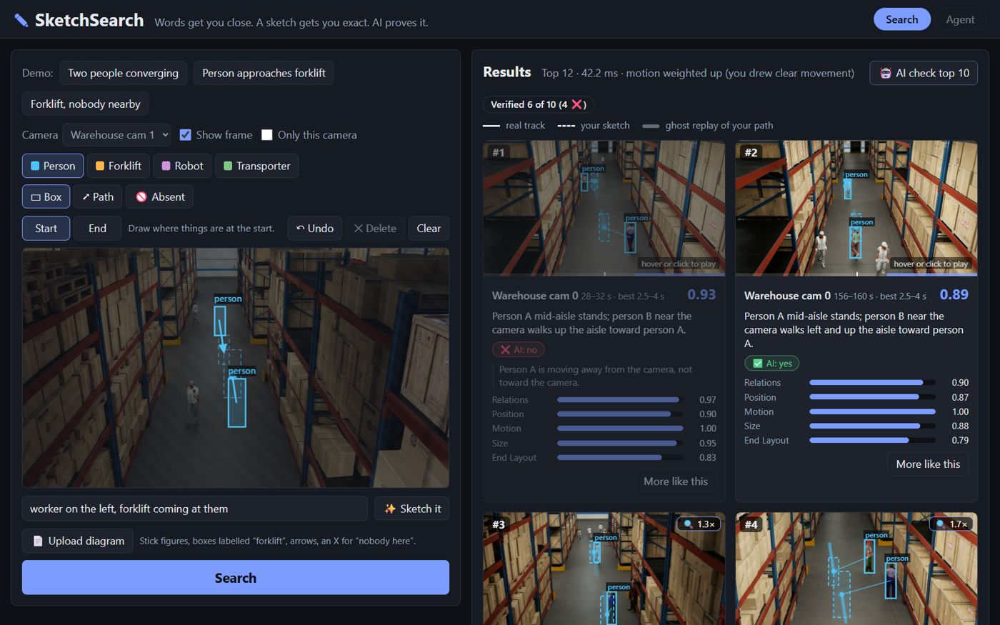
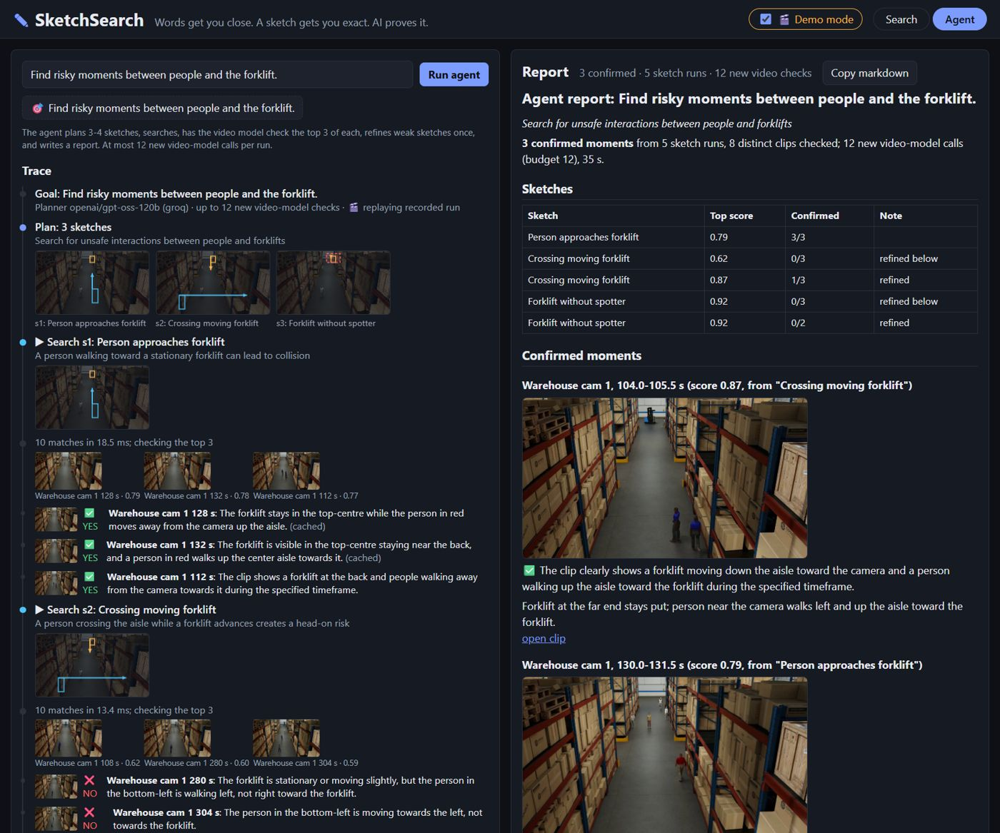

# SketchSearch

> **Words get you close. A sketch gets you exact. AI proves it.**

Draw the moment you are looking for (who is where, which way they move, where *nobody* should be) and
SketchSearch finds it across hours of camera footage. A video model then watches each hit and says
✅ / ❌ / ⚠️ with a one-sentence reason. Built for the VAST Builders Challenge (Real-Time Video Agents Hack
NYC), aimed at incident investigators: workplace safety, insurance, traffic engineering.



## What it does

- **Sketch search.** Labelled boxes (person, forklift, robot, transporter), motion paths, Start/End keyframes,
  and **🚫 "nobody here" zones** for searching what is *absent* ("forklift with no spotter"). A geometric
  matcher scores every 1.5 s window of every 4 s segment.
- **AI verification.** The top 10 clips go to a video model (Gemini now, Cosmos3-Reason on the VAST stack)
  with a question written from your sketch in plain spatial words. Verdicts stream in over SSE ("Verified 6 of
  10"). Rejected clips dim but stay visible, with the model's reason.
- **✨ Words → Sketch.** Type "worker on the left, forklift coming at them". An LLM draws the sketch box by
  box, then the search runs.
- **📄 Diagram → Sketch.** Upload a hand-drawn incident diagram (stick figures, a box labelled "forklift",
  arrows, an X for "nobody here") and it becomes an editable sketch.
- **Agent mode.** Give a goal ("Find risky moments between people and the forklift"). The agent plans 3-4
  sketches, searches, verifies the top 3 of each (at most 12 new video-model calls per run), refines weak
  sketches once, and writes a markdown report of the confirmed clips. Every step streams into a live trace.
- **Results you can check.** Each clip plays with your sketch (dashed) and the real tracks (solid) overlaid
  and time-synced, plus a ghost replay of your path, score bars, a one-line explanation, an auto-zoom on small
  far-away objects, and "More like this".
- **Demo mode.** `scripts/warm_demo.py` pre-computes the presets and one agent run, so a live demo never waits.



## Architecture

```
 Browser (static/: index.html, app.js, agent.js, Fabric.js from cdnjs; relative URLs, works under /app)
   │  JSON + server-sent events
   ▼
 FastAPI  app/main.py ──────────────────────────────────────────────────────────────────────────────
   │  /api/search  /api/verify (SSE)  /api/agent (SSE)  /api/text-to-sketch  /api/diagram-to-sketch
   │  /api/segments/{id}[/as-sketch]  /api/health  /health  + static clips/frames
   │
   ├─ app/matcher/      geometric scoring: windows × Hungarian assignment; position, size, motion,
   │                    End layout, relations, converging bonus; absent zones ×0.2   (numpy/scipy)
   ├─ app/verify.py     sketch → spatial question → source.ask(); concurrency 3, disk cache, backoff, timeout
   ├─ app/agent/        words_to_sketch (LLM) · runner: plan → match → verify → refine → report
   ├─ app/vision/       Gemini: inline-video verification, diagram → sketch
   ├─ app/llm/          OpenAI-compatible client: Groq now, W&B Inference via LLM_PROVIDER=wandb
   ├─ app/explain.py    local one-line explanations from the matched tracks (no LLM)
   └─ app/sources/      VideoSource protocol
        ├─ LocalSource  data/index.json (ground-truth tracks) or index_yolo.json; CLIP text search
        └─ VastSource   VSS backend (JWT) search + clips · VastDB rows/detections · Cosmos3-Reason ask
                                    │
 Weave traces every LLM call, matcher eval, verification and agent run (W&B project: WEAVE_PROJECT)

 Offline: scripts/build_index.py  videos → 4 s segments, keyframes, GT index, YOLO11+ByteTrack index, CLIP
          scripts/eval_matcher.py  noisy sketches from real segments → Recall@k, ablations, direction check
```

## Run it

Needs Python 3.12, [uv](https://docs.astral.sh/uv/), ffmpeg, and API keys for Gemini (verification,
diagrams), Groq or W&B (LLM) and optionally W&B (Weave).

```bash
uv sync
cp .env.example .env                      # fill in GROQ_API_KEY, GEMINI_API_KEY, WANDB_API_KEY, HF_TOKEN
# data: NVIDIA PhysicalAI-SmartSpaces, MTMC_Tracking_2026/val/Warehouse_022 (4 cameras, 309 s each;
#       see the dataset card for the license) into data/raw/warehouse/, full videos in data/videos/
uv run python -m scripts.build_index      # segments, keyframes, GT + YOLO indexes, CLIP, alias report
uv run uvicorn app.main:app --port 8000   # http://localhost:8000
uv run pytest -q                          # 54 tests
```

Optional: `uv run python -m scripts.eval_matcher` (eval + Weave), `uv run python -m scripts.warm_demo`
(demo cache), `uv run python -m scripts.make_test_diagrams` (test diagrams). Moving to the VAST stack:
**[FRIDAY.md](FRIDAY.md)**.

## Results

**Matcher** (`scripts/eval_matcher.py`, ground-truth index, 308 segments). Each query is a sketch built from
a real segment's tracks (1-3 objects) with hand-drawn-style noise: box centres ±0.05, sizes ±20%, paths cut
to 3-5 points. The target is that exact segment out of 308.

| Weights | Queries | R@1 | R@5 | R@10 | MRR |
|---|---|---|---|---|---|
| Plan (initial) | tuning set, 100 | 0.39 | 0.67 | 0.77 | 0.53 |
| Tuned (one grid search) | tuning set, 100 | 0.58 | **0.82** | 0.93 | 0.69 |
| Tuned + adaptive motion (default) | tuning set, 100 | 0.56 | 0.82 | 0.91 | 0.68 |
| Plan | held-out, 100 | 0.44 | 0.72 | 0.82 | 0.56 |
| Tuned + adaptive motion (default) | held-out, 100 | 0.59 | **0.85** | 0.90 | 0.70 |

- By category (default weights): person + forklift R@5 0.94, robot/transporter 0.93, person-only 0.77.
- By sketch size: 1 object 0.60, 2 objects 0.88, 3 objects 0.97. Relationships are what make a sketch precise.
- Direction check: when the real objects move at least 0.1, the correct direction scores above the reversed one
  in 100% of 19 cases. At ≥0.05 (69 cases) it is 98.6-100%, against 94-96% with the plan weights.
- Latency: about 50 ms over 308 segments and about 0.4-0.6 s over 2,156, on a 4-core laptop CPU.

**AI verification** (Gemini `gemini-3.5-flash-lite`, top 10 per preset):

| Preset | YES | NO | UNSURE |
|---|---|---|---|
| Two people converging | 6 | 4 | 0 |
| Person approaches forklift | 10 | 0 | 0 (8/0/2 on the first run: one timeout, one Google 504) |
| Forklift, nobody nearby | 1 | 9 | 0 |

On "nobody nearby" the model rejects all 7 clips the matcher had already flagged as violating the zone. It
also overrules 2 the matcher passed, where a person stands just outside the drawn zone.

**Agent** (preset goal, recorded run): 3 sketches, 2 refined, 5 searches; 8 distinct clips checked with
exactly the 12-call budget; 3 confirmed moments. 35 s live, about 6 s replayed in Demo mode.

**Detector reality check** (`data/alias_report.json`, YOLO11n vs ground truth, IoU > 0.5): person recall
0.73 (0.86 on larger boxes). Forklift, robot and transporter: 0. The "truck/boat/bus" detections were
shelving. YOLOE / YOLO-World with custom prompts reach forklift recall of 0 to 0.5 on the same frames, at
about 1 s per frame on CPU. That is why development runs on the ground-truth tracks.

## Honest limitations

- **The footage is synthetic** (NVIDIA's rendered warehouse), and development uses its ground-truth tracks.
  With a real detector, the forklift isn't detected at all (see above), so search quality on the VAST pack
  depends on its detections (FRIDAY.md has the fallbacks).
- **The eval measures the matcher, not the people using it.** Sketches come from real tracks plus synthetic
  noise. Real users draw less precisely and less consistently. Single-object sketches stay ambiguous (R@5 0.60).
- **Weights were tuned once on 100 queries.** The held-out set agrees (0.85), but both come from the same 308
  segments of one scene.
- **The verifier is a small, free model, and it can be wrong.** It sometimes says YES when a distant person
  is inside the zone (`cam1_252`): fine regions at the far end of an aisle are hard for it. Free-tier quotas
  are tight (`gemini-2.5-flash` allows 20 requests a day), and calls take 3-15 s, so some come back UNSURE on
  timeouts. The cache and Demo mode hide this in a demo; it is still there.
- **"Absent" means an image region, not a physical distance.** At the far end of an aisle a small zone covers
  several metres.
- **The LLM's sketches are plausible, not calibrated.** Words → Sketch and agent plans follow the scene
  description in the prompt; a forklift "coming at them" may move further in 1.5 s than a real one does.
- **VastSource is written from the docs and tested against mocked responses only.** Every format guess is
  marked `FRIDAY-VERIFY` and is checked with `scripts/vast_probe.py` on the day.

## Project layout

```
app/        FastAPI app, matcher, sources, AI layer, agent
static/     UI (no build step)
scripts/    build_index, eval_matcher, example_searches, warm_demo, make_test_diagrams, package_k8s, vast_probe
tests/      54 tests: matcher (synthetic + real absent cases), AI layer, agent, VastSource (mocked)
deploy/k8s/ entry point + runtime requirements for deploy-app-no-registry
data/       alias_report.json, eval_report.json, test_diagrams/ (videos, indexes and caches are git-ignored)
```
